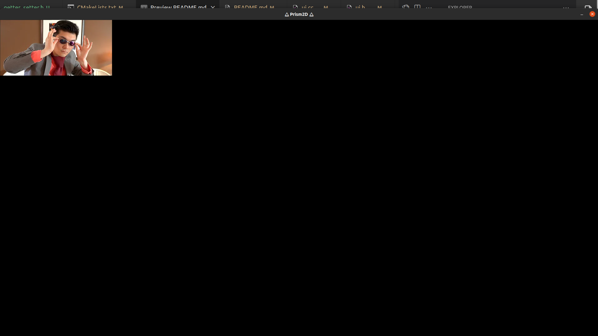

# Prism 2D

NOTE: 
I am just playing around with this for fun or when I get bored, it's nothing serious

Prism2D is a follow up on my first game engine attempt, called lovelyGameEngine.

That project was an absolute mess, now I have a decent plan of what I wish to use and how the engine is going to work

Jk, I have no clue on how to do any of what I did (or want to do (like building an executable for a game)) in this repo. I just got bored and decided to do this so don't expect anything serious from it.

## Building
- Building the engine:
  
    1. `git submodule init && git submodule update` (Or clone with `--recursive`)

```bash
mkdir build && cd build
cmake -G Ninja ../
ninja
cp -r ../api/prism2d . # Python api
cp ../api/example.py . # Python script to test the api
./Prism2D example # Note the absence of the .py extension (This is caught and logged as an error by the engine aswell)
```

## Screenshots
### Engine logging
</img>
### Engine logging error
</img>
### Engine
</img>

(The background color above was set using the python api for the game engine. The source can be found in api/) Pretty cool, huh? :-)

- Depends on (apt package manager names):
    - allegro5, cmake, ninja

- Depends on (submodule):
    - loguru (Logging)
    - imgui (GUI)
    - config-parser
